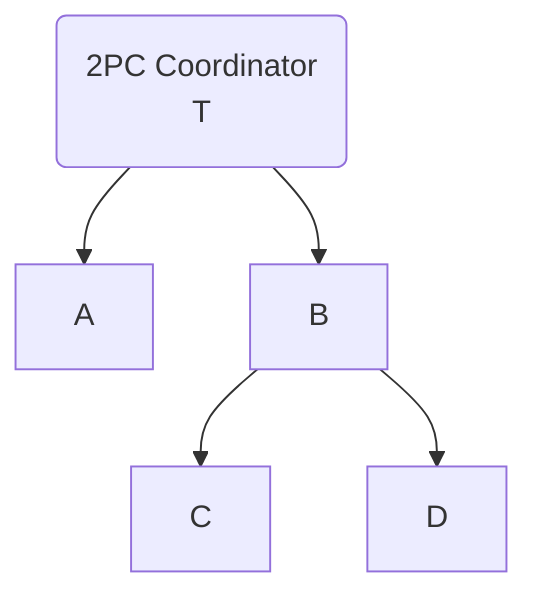
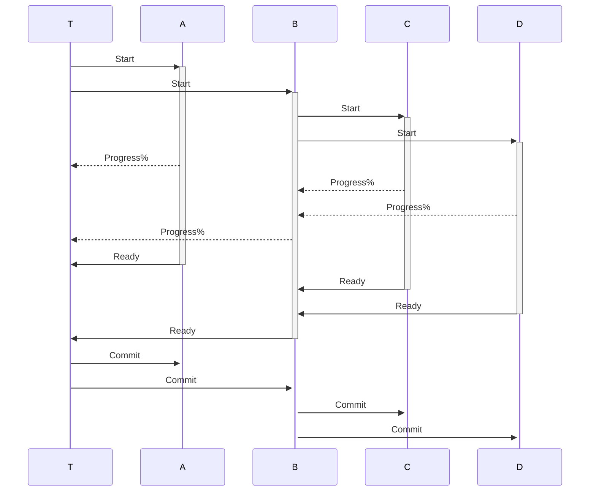

## Minimum Two Phase Commit protocol (2PC)

### 2PC TransactionContext
Minimum child->parent 2PC messaging interface
```csharp
public interface ITransactionContext
{
    TransId GetTransId();
    void Progress(double percent);
    void Ready(bool readyToCommit, string? message = null);
    IReceive<TrDecision> Decision();
    ITransactionContext Branch();
}
```
### 2PC tree



