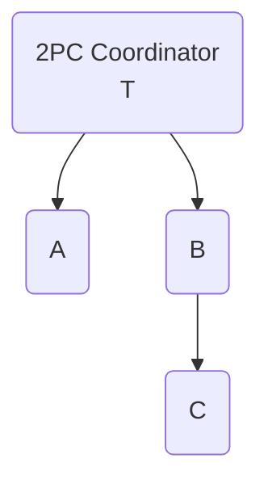
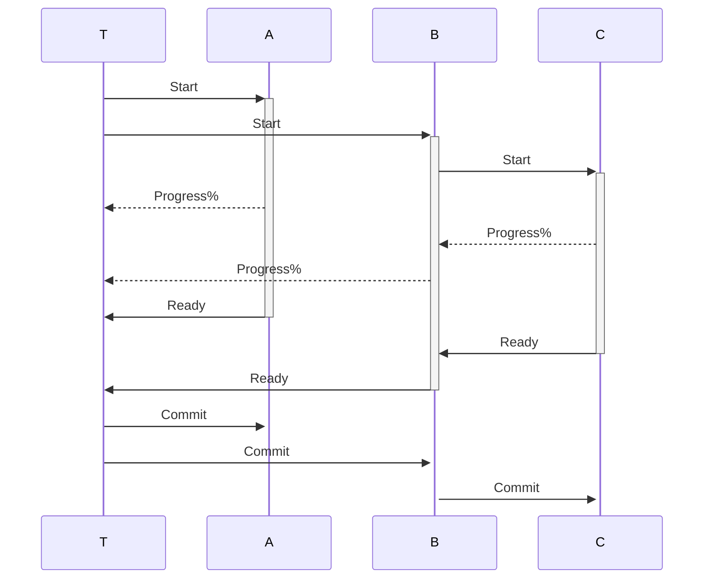

## Minimum Two Phase Commit protocol (2PC)

### 2PC TransactionContext
Minimum child->parent 2PC messaging interface
```csharp
public interface ITransactionContext
{
    TransId GetTransId();
    void Progress(double percent);
    void Ready(bool readyToCommit, string? message = null);
    IReceive<TrDecision> Decision();
    ITransactionContext Branch();
}
```
### 2PC TransactionContext tree




### Application - distributed tables
Initial state

    Accounts, Partition A
    | id | name  | balance | tid|
    |:---|:------|--------:|----|
    | 2  | B     |  350.00 |  - |
    | 3  | C     | 9800.75 |  - |

    Accounts, Partition B
    | id | name  | balance | tid|
    |:---|:------|--------:|----|
    | 1  | A     | 1200.50 |  - |


Transaction T1 Update (Isolated)

     B      balance  -50.00 =  300.00
     A      balance -200.50 = 1000.00
    Transactions
    | tid | state     |
    |-----|-----------|
    |  T1 | Started   |
    => ChangeSet:

    Accounts, Partition A 
    => T1 Ready
    | id | name  | balance | tid |
    |:---|:------|--------:|-----|
    | 2  | B     |  300.00 |  T1 |

    Accounts, Partition B
    => T1 Ready
    | id | name  | balance | tid |
    |:---|:------|--------:|-----|
    | 1  | A     | 1000.00 |  T1 |

    Transactions
    | tid | state     |
    |-----|-----------|
    |  T1 | Ready     |


TwoPhaseCommit T1
  All Ready => Can Commit

    Transactions
    | tid | state     |
    |-----|-----------|
    |  T1 | Committed |

    Accounts, Partition A
    | id | name  | balance | tid|
    |:---|:------|--------:|----|
    | 2  | B     |  300.00 | T1 |
    | 3  | C     | 9800.75 |  - |

    Accounts, Partition B
    | id | name  | balance | tid|
    |:---|:------|--------:|----|
    | 1  | A     | 1000.00 | T1 |
